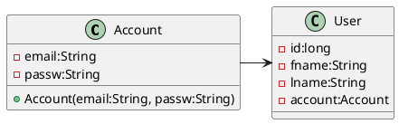

```plantuml
@startuml

class Account {
    - email:String
    - passw:String
    + Account(email:String, passw:String)
}

class User {
    - id:long
    - fname:String
    - lname:String
    - account:Account
}

Account -> User
@enduml
```